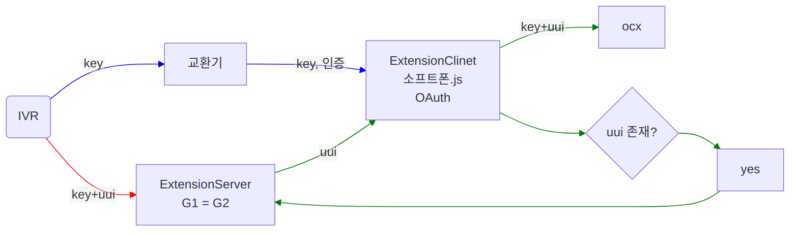

# study
buchun-study

H1 testMermaid

```mermaid
%%{init: {"flowchart": {"htmlLabels": false}} }%%
flowchart LR
ivr(IVR)
cti[교환기]
ext["ExtensionServer
				G1 = G2"]
soft["ExtensionClinet
소프트폰.js
OAuth"]
ivr-->|key+uui|ext
ivr-->|key|cti-->|key, 인증|soft--> |key+uui|ocx
soft-->if{uui 존재?}-->yes-->ext--uui-->soft

%% 화살표 순서를 나타내는 숫자 값으로 설정
linkStyle 1,2 stroke:blue;
linkStyle 0 stroke:red;
linkStyle 3,4,5,6,7 stroke:green;
```
